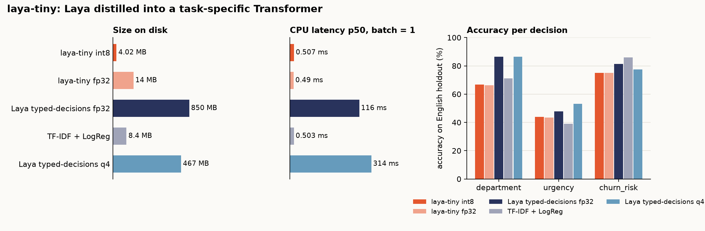

# laya-tiny



**Laya, shrunk to ~3 MB for one fixed job.** [Laya](https://github.com/NandhaKishorM/laya) answers typed
questions about any text in a single forward pass, but it is a 400M-parameter ModernBERT: 1.7 GB in fp32 and still
467 MB in q4. When the questions never change (here: *which team, how urgent, is the customer about to leave?*)
you don't need a model that can read arbitrary questions. laya-tiny distils Laya's answers into a
**~3.3M-parameter Transformer with its own tokenizer and three fixed heads**, trained end to end by one
reproducible pipeline — the way you'd run a YOLO training loop, just for text triage.

<!-- RESULTS -->

## What it trades away

The student only knows the three decisions in [`configs/task.yaml`](configs/task.yaml). Add a decision, change an
option, or reword a question and you must re-label and re-train (`task.version` bumps invalidate every cached
stage). Laya's "ask a new question at run time" ability is gone. The teacher checkpoint (`typed-decisions`) is
English-only, so the student is too; the report shows the other-language slice separately so you can see it fail.

## Pipeline

```
data ──► label ──► split ──► tokenizer ──► train ──► calibrate ──► export ──► eval ──► report
 │         │         │           │            │           │            │         │
 │         │         │           │            │           │            │         └ reports/<date>.{md,json}, overview.png
 │         │         │           │            │           │            └ student.onnx, student.int8.onnx (+ torch ≡ onnx check)
 │         │         │           │            │           └ one temperature per head (val split)
 │         │         │           │            └ KL(teacher‖student)·T² + weak-label CE, early stop on teacher agreement
 │         │         │           └ byte-level BPE, 8k, trained on the train split only
 │         │         └ drop rows near-duplicating the holdout (word-3-gram Jaccard ≥ 0.6), hash split train/val
 │         └ Laya typed-decisions fp32 → full probability distribution per decision (resumable cache)
 └ public support tickets → clean → English → truncate → de-dup (≈30k rows)
```

Every stage is cached by a fingerprint of **its code, the config keys it reads and the hashes of its input files**.
Change `train.lr` and only `train → … → report` re-run; edit the holdout and `split` notices. The label cache is
keyed by teacher identity (checkpoint, Hub revision, temperatures) plus the question text, so an interrupted
labelling run resumes where it stopped and a new question never reuses stale labels.

| stage | what it does | key config |
|---|---|---|
| `data` | downloads [Tobi-Bueck/customer-support-tickets](https://huggingface.co/datasets/Tobi-Bueck/customer-support-tickets) and [Bitext customer support](https://huggingface.co/datasets/bitext/Bitext-customer-support-llm-chatbot-training-dataset); treats all text as untrusted (control chars, tags, placeholders), keeps English, truncates at a sentence boundary, de-dups; derives *weak* department labels from unambiguous source metadata | `data.*` |
| `label` | runs Laya `typed-decisions` (pinned revision) in batches on MPS/CUDA/CPU; validates every distribution (shape, finite, sums to 1) | `task.teacher`, `task.decisions` |
| `split` | leakage guard against the holdout, deterministic 94/6 train/val split by content hash | `data.leak_jaccard`, `data.val_fraction` |
| `tokenizer` | byte-level BPE (no `[UNK]`, ever); reports UNK rate, mean/p95 tokens, truncation share | `model.tokenizer` |
| `train` | pre-LN encoder, mean pooling, 3 heads; AdamW + warmup/cosine; logs to `runs/<id>/` | `model.encoder`, `train.*` |
| `calibrate` | grid-searched temperature per head against the teacher's distributions | `calibrate.grid` |
| `export` | ONNX opset 17 with probabilities as outputs, dynamic batch/seq; asserts ≤ 1e-4 vs PyTorch; dynamic int8 (MatMul + embedding Gather) | `export.*` |
| `eval` | every backend on the same 224-row hand-labelled holdout: accuracy, macro-F1, ECE, teacher agreement, TV distance, size, CPU p50/p95 at batch = 1 | `eval.*` |
| `report` | Markdown + JSON + chart, and a PASS/FAIL table for the acceptance targets | – |

## Run it

```bash
make setup            # uv venv (py3.12) + editable install with the Laya teacher extra
make test             # pytest: 50+ unit tests + an end-to-end smoke run
make smoke            # whole pipeline offline in ~10 s (templated corpus, keyword teacher)
make report           # the real thing: ~30 min labelling on an M4 Pro, ~10 min training
make status           # which stages are fresh / stale
make train FORCE=train                          # re-run one stage
make report SET="data.max_rows=4000 train.epochs=10"   # override any config key
```

Laya q4 as an extra row in the table (needs a [laya-webgpu](https://github.com/game-design-projects/laya-webgpu)
checkout with the q4 model):

```bash
make laya-q4 LAYA_TS=../laya-webgpu/vendor/laya-ts LAYA_Q4=../laya-webgpu/model
# then list work/external/laya-q4.jsonl under eval.external in configs/pipeline.yaml
```

### Using the exported model

`work/export/` holds `student.int8.onnx`, `tokenizer.json` and `meta.json` (label order, max_len, temperatures,
hashes). Outputs are already-calibrated probabilities, one tensor per decision:

```python
import numpy as np, onnxruntime as ort
from tokenizers import Tokenizer

tok = Tokenizer.from_file("work/export/tokenizer.json"); tok.no_padding()
sess = ort.InferenceSession("work/export/student.int8.onnx")
ids = np.array([tok.encode("Charged twice again. Refund today or we cancel.").ids], dtype=np.int64)
dept, urgency, churn = sess.run(None, {"input_ids": ids, "attention_mask": np.ones_like(ids)})
# dept ~ [billing, technical, account, sales], urgency ~ [0, 1, 2], churn ~ [false, true]
```

## CI

- **`ci.yml`** (every push / PR): pytest + `make smoke` on a hosted Ubuntu runner, CPU only; uploads the smoke report.
- **`full.yml`** (manual or monthly): the real pipeline with the Laya teacher on CPU. CPU labelling is slow, so the
  corpus is capped by the `max_rows` input (default 4000) and the label cache is carried between runs. Uploads the
  report and the ONNX files as artifacts. Weights never go into git.

## Layout

```
configs/      task.yaml (decision contract) · model.yaml · pipeline.yaml (+ smoke profile) · questions.json
data/holdout/ tickets.jsonl — 224 hand-labelled rows, evaluation only (provenance + labelling policy in its README)
src/laya_tiny/ one module per stage + stages.py (the cached runner) + cli.py
tools/        laya_onnx_predict.mjs — Laya split-ONNX (e.g. q4) predictions for eval.external
tests/        unit tests per module, test_pipeline_smoke.py end to end
reports/      committed evaluation reports and the chart above
```

## Licence and data

Code: Apache-2.0. Laya is used only as a teacher at training time; nothing from it is redistributed. The default
corpus includes CC BY-NC 4.0 data, so models trained with the default config inherit a non-commercial restriction —
see [NOTICE](NOTICE). The holdout's labelling policy: a stated threat to leave counts as at least *soon* for urgency;
"blocking" means work or money is stopped right now.
